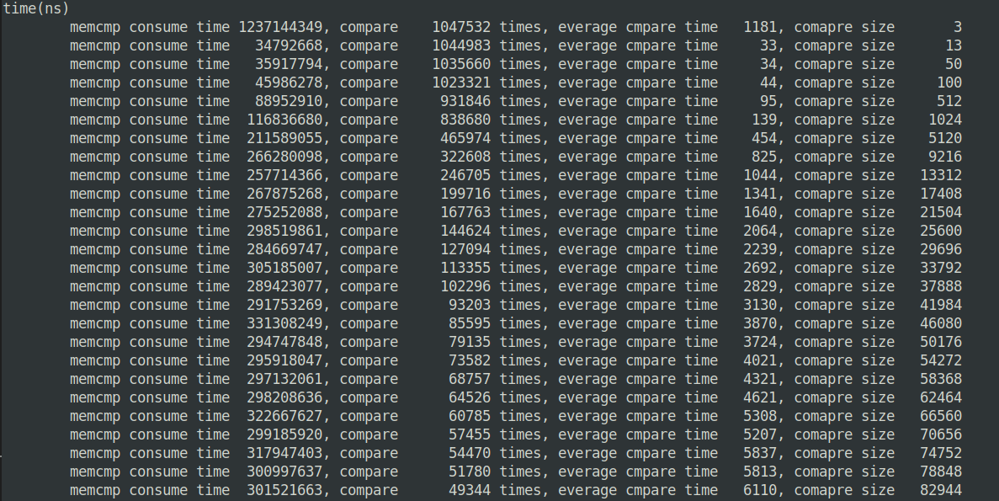

# glibc-memcmp-avx2-notes
1. A simple note for reading glibc memcmp asm code

2. A new version of memcmp which add a fourth parameter to return the first memory addr that diff.

## Compile  
Put two file in same dir, compile with command

```
gcc -ggdb -o memcmpGlibcASMTester memcmpGlibcASMTester.c memcmp-avx2-addr.S
```

run with
```
./memcmpGlibcASM
```
## Performance
Tested with all zeros.


